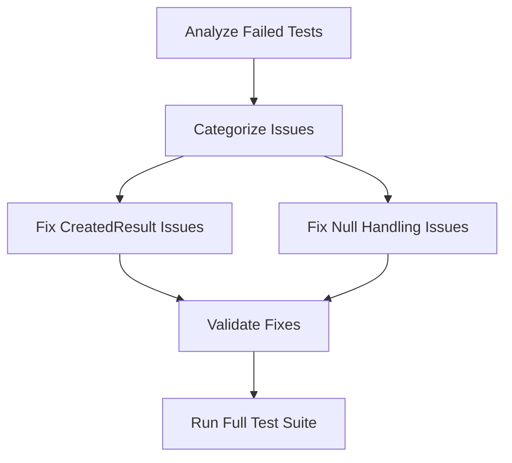

# Design Document

## Overview

This design document outlines the systematic approach to fix failing unit tests in the ModbusSimulator project. The primary focus is on correcting test assertions to match the actual controller behavior while maintaining the integrity of the API design and test coverage.

## Steering Document Alignment

### Technical Standards (tech.md)
The design follows established patterns by:
- Maintaining consistent API response types across controllers
- Preserving RESTful conventions for resource creation (201 Created responses)
- Using ASP.NET Core standard result types appropriately

### Project Structure (structure.md)
The implementation maintains the existing test structure:
- Controller tests remain in `ModbusSimulator.Tests/Controllers/`
- Test naming conventions are preserved
- Mock dependencies continue to use the established patterns

## Code Reuse Analysis

### Existing Components to Leverage
- **xUnit Test Framework**: Continue using existing test infrastructure
- **Moq Framework**: Reuse established mocking patterns for service dependencies
- **ASP.NET Core TestHost**: Maintain integration test patterns where applicable

### Integration Points
- **Controller Layer**: Tests must align with actual controller implementations
- **Service Layer Mocks**: Existing mock setups remain unchanged
- **Model Validation**: Test assertions must reflect actual validation behavior

## Architecture

The test fix architecture follows a systematic approach:

1. **Analysis Phase**: Identify specific assertion mismatches
2. **Categorization Phase**: Group similar issues for batch processing
3. **Fix Phase**: Update test assertions to match actual behavior
4. **Validation Phase**: Ensure fixes don't break other tests

### Modular Design Principles
- **Single Test Responsibility**: Each test verifies one specific behavior
- **Assertion Isolation**: Fix assertions without changing test logic
- **Mock Preservation**: Maintain existing mock configurations
- **Behavioral Consistency**: Ensure similar endpoints have consistent test patterns



## Components and Interfaces

### Test Assertion Corrector
- **Purpose:** Updates test assertions to match actual controller behavior
- **Interfaces:** Direct file modification of test methods
- **Dependencies:** Understanding of ASP.NET Core result types
- **Reuses:** Existing test structure and mock configurations

### Test Validator
- **Purpose:** Ensures fixes don't introduce regressions
- **Interfaces:** Executes test suites and reports results
- **Dependencies:** dotnet test CLI and xUnit framework
- **Reuses:** Existing test execution infrastructure

## Data Models

### Test Fix Record
```csharp
- TestClass: string (e.g., "ConnectionsControllerTests")
- TestMethod: string (e.g., "CreateConnection_ValidRequest_ReturnsCreatedResult")
- Issue: string (e.g., "Expected CreatedResult, got CreatedAtActionResult")
- LineNumber: int (location of assertion)
- Status: string (pending/in-progress/completed)
```

### Fix Category
```csharp
- CategoryName: string (e.g., "CreatedResult_to_CreatedAtActionResult")
- AffectedTests: List<string>
- FixPattern: string (description of the fix approach)
```

## Error Handling

### Error Scenarios
1. **Assertion Type Mismatch:** Expected type doesn't match actual return type
   - **Handling:** Update assertion to match actual controller behavior
   - **User Impact:** Test passes and accurately reflects API behavior

2. **Null Request Handling:** Test expects success but controller returns error
   - **Handling:** Update test expectation to match validation behavior
   - **User Impact:** Test accurately validates error handling

3. **HTTP Status Code Mismatch:** Expected status doesn't match actual
   - **Handling:** Verify controller behavior and update test accordingly
   - **User Impact:** Test validates correct HTTP semantics

## Testing Strategy

### Unit Testing
- Fix individual test methods one at a time
- Verify each fix by running the specific test
- Ensure mock configurations remain appropriate

### Integration Testing
- Run full test suites after batches of fixes
- Verify no regressions are introduced
- Confirm overall test coverage is maintained

### End-to-End Testing
- Execute complete test suite after all fixes
- Validate that fixed tests continue to pass
- Ensure API behavior remains consistent

## Implementation Plan

### Phase 1: CreatedResult Issues
Fix all tests expecting `CreatedResult` but receiving `CreatedAtActionResult`:
- ConnectionsController: 1 test
- RegistersController: 9 tests

### Phase 2: Null Handling Issues  
Fix tests with incorrect expectations for null/invalid requests:
- RegistersController: 2 tests

### Phase 3: Validation
Run comprehensive test suite to ensure all fixes work correctly and no regressions exist.